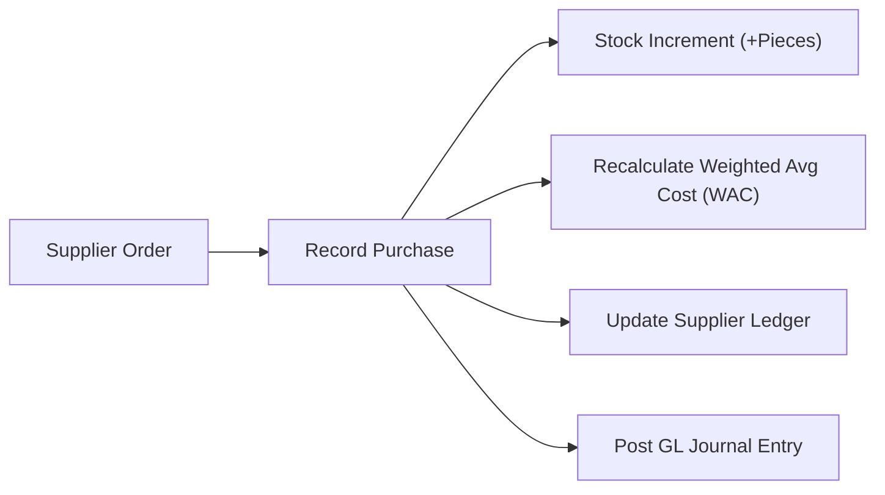
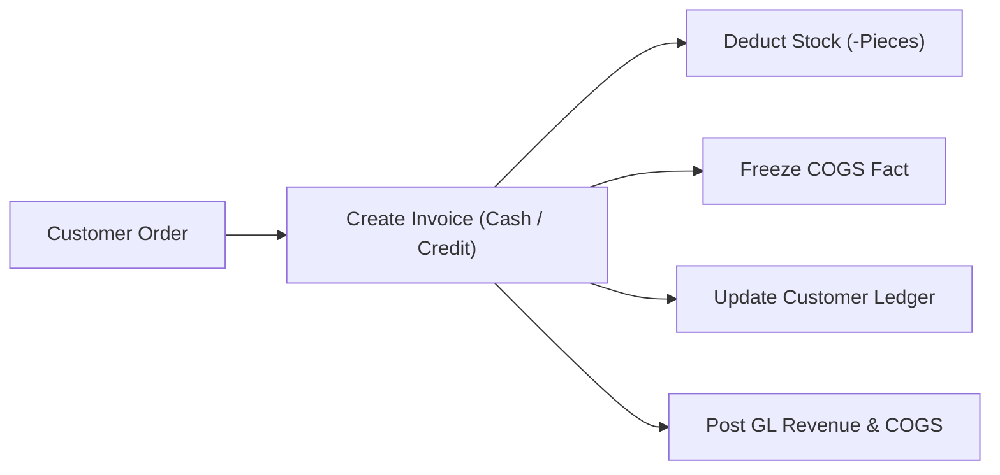
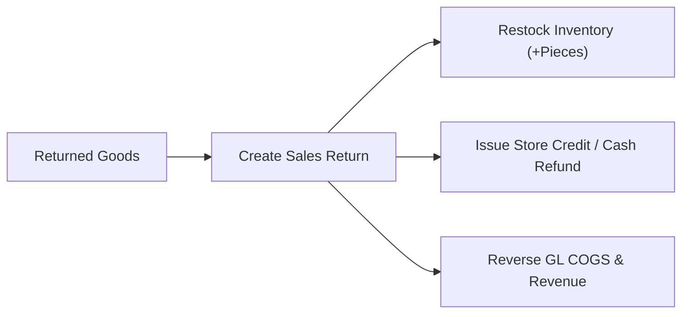
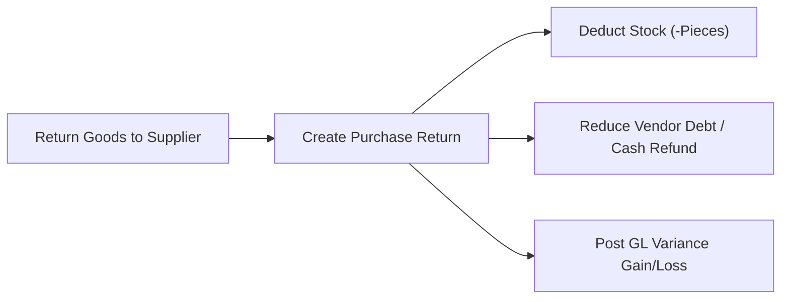
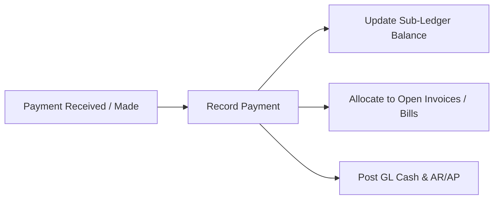
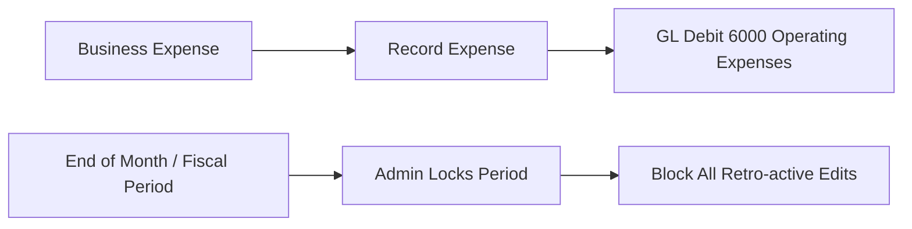

# SameerTraderz ERP — Complete System Flow & Executive Briefing Guide

> **Executive Briefing & System Handbook**  
> *Created for Business Stakeholders, Operations Managers, Auditors, and System Administrators.*  
> *This guide explains the entire SameerTraderz ERP system from first principles, requiring zero prior technical or accounting background.*

---

## 1. Executive Briefing (1-Page Quick Summary)

### What is SameerTraderz ERP?
SameerTraderz ERP is an enterprise-grade wholesale distribution, inventory tracking, and double-entry financial accounting system built specifically for FMCG (Fast-Moving Consumer Goods) wholesale operations (such as hygiene products, tissues, soaps, and diapers).

### What Does the System Do?
1. **Tracks Inventory in Real Time:** Tracks exact physical stock in single piece units using Weighted Average Costing (WAC). Every box bought or item sold immediately updates physical stock and financial stock value.
2. **Manages Wholesale Sales & Invoicing:** Handles cash sales, credit sales, salesman performance targets, discounts, transport allowances, and upfront cash collections.
3. **Automates Customer & Supplier Ledgers:** Tracks exact balances owed by customers (Accounts Receivable) and owed to suppliers (Accounts Payable).
4. **Enforces Double-Entry Accounting:** Every rupee moving through the business (sales, purchases, payments, returns, expenses) automatically posts balanced Debit and Credit entries to the General Ledger (GL).
5. **Protects Historical Financials (Period Locks):** Admin users can lock closed fiscal months. Once locked, no transactions or edits can alter historical financial records.

---

## 2. Core Business Architecture

```
                               ┌────────────────────────────────────────┐
                               │       SameerTraderz ERP Core           │
                               └───────────────────┬────────────────────┘
                                                   │
         ┌────────────────────────┬────────────────┴────────┬────────────────────────┐
         ▼                        ▼                         ▼                        ▼
┌─────────────────┐      ┌─────────────────┐       ┌─────────────────┐      ┌─────────────────┐
│ Inventory Stock │      │  Sales & Credit │       │ Sub-Ledger      │      │ General Ledger  │
│ Tracking (WAC)  │      │  Management     │       │ Accounts (AR/AP)│      │ Double-Entry P&L│
└─────────────────┘      └─────────────────┘       └─────────────────┘      └─────────────────┘
```

---

## 3. The 6 Complete Business Lifecycle Flows

---

### FLOW 1: Stock Purchasing & Procurement (Vendor Buying)



#### What Happens Step-by-Step:
1. **Purchase Entry:** Operator records a purchase from a Supplier specifying items, piece quantities, and purchase prices.
2. **Stock Increment:** Physical stock quantity (`Product.stockQuantity`) is automatically increased in piece units.
3. **Weighted Average Cost (WAC) Update:** The system re-calculates the product's average unit cost:
   $$\text{New WAC} = \frac{(\text{Existing Stock} \times \text{Existing WAC}) + (\text{New Qty} \times \text{New Unit Cost})}{\text{Total Stock Quantity}}$$
4. **Supplier Ledger Record:**
   - If unpaid: Increases what we owe the supplier (Credit `SupplierLedger`).
   - If partial cash paid: Records payment debit to supplier.
5. **General Ledger (GL) Posting:**
   - **Debit:** `1300 - Inventory Asset` (Value of goods received)
   - **Credit:** `1000 - Cash in Hand` (Cash paid upfront)
   - **Credit:** `2000 - Accounts Payable` (Remaining amount owed)

---

### FLOW 2: Sales Invoicing & Revenue Generation (Selling)



#### What Happens Step-by-Step:
1. **Invoice Creation:** Sales representative or counter staff creates a sales invoice for a customer (Cash sale or Credit sale).
2. **Stock Deduction:** Physical stock quantity (`Product.stockQuantity`) is instantly deducted.
3. **Freezing Historical Cost of Goods Sold (COGS):**
   - The current unit WAC at the moment of sale is **frozen forever** into `InvoiceItem.costPriceAtSale`.
   - Changing future stock costs will **never** alter the profit calculated for this sale.
4. **Customer Ledger Record:**
   - For Credit Sales: Debits `CustomerLedger` (increases what customer owes us).
   - If upfront cash collected: Credits `CustomerLedger` for cash received.
   - If store credit applied: Consumes customer's store credit.
5. **General Ledger (GL) Posting:**
   - **Debit:** `1000 - Cash in Hand` (Cash collected)
   - **Debit:** `1100 - Accounts Receivable` (Unpaid credit invoice balance)
   - **Debit:** `2100 - Customer Deposits` (Store credit applied)
   - **Credit:** `4000 - Sales Revenue` (Gross invoice sales total)
   - **Debit:** `5000 - Cost of Goods Sold` (Total frozen COGS)
   - **Credit:** `1300 - Inventory Asset` (Inventory reduction value)

---

### FLOW 3: Customer Sales Returns & Store Credit



#### What Happens Step-by-Step:
1. **Sales Return Processing:** Operator creates a sales return against an existing invoice. The system enforces that return quantity cannot exceed remaining returnable items.
2. **Inventory Restocked:** Returned items re-enter live physical stock at the current pool WAC.
3. **Refund Selection:**
   - **Registered Customer:** Automatically credited as **Store Credit** (Customer balance becomes negative or credit balance increases).
   - **Walk-in / Cash Refund:** Cash refunded directly to customer.
4. **General Ledger (GL) Posting:**
   - **Debit:** `4100 - Sales Returns & Allowances` (Revenue deduction)
   - **Credit:** `1100 - Accounts Receivable` or `1000 - Cash in Hand`
   - **Debit:** `1300 - Inventory Asset` (Restocked inventory value)
   - **Credit:** `5000 - Cost of Goods Sold` (COGS reversal)

---

### FLOW 4: Purchase Returns & Vendor Claims



#### What Happens Step-by-Step:
1. **Purchase Return Entry:** Operator processes a return of damaged or incorrect goods back to the supplier.
2. **Stock Decremented:** Stock quantity is deducted at current pool WAC.
3. **Vendor Settlement:**
   - Reduces Accounts Payable liability owed to supplier (Debit `SupplierLedger`).
   - If cash refund received: Debits GL `1000` (Cash in Hand).
4. **Variance Accounting:**
   - If agreed refund rate differs from stock pool WAC, the difference is posted to **`5100 - Purchase Return Variance`** as a Gain or Loss.

---

### FLOW 5: Customer & Supplier Payments & Allocations



#### What Happens Step-by-Step:
1. **Customer Payment Received:**
   - Operator records customer cash/bank payment.
   - Sub-ledger (`CustomerLedger`) credited $\rightarrow$ Customer balance decreases.
   - GL Posting: Debit `1000 - Cash in Hand`, Credit `1100 - Accounts Receivable`.
2. **Invoice Allocation:** Payment amount is allocated against specific unpaid invoice balances (`balanceDue`).
3. **Supplier Payment Made:**
   - Operator records payment to supplier.
   - Sub-ledger (`SupplierLedger`) debited $\rightarrow$ Supplier balance decreases.
   - GL Posting: Debit `2000 - Accounts Payable`, Credit `1000 - Cash in Hand`.

---

### FLOW 6: Expenses & Fiscal Period Locks



#### What Happens Step-by-Step:
1. **Business Expenses:**
   - Operating expenses (rent, electricity, salaries, tea/fuel) recorded with expense categories.
   - GL Posting: Debit `6000 - Operating Expenses`, Credit `1000 - Cash in Hand`.
   - Modifying or deleting expenses automatically cleans up or reverses GL entries.
2. **Accounting Period Closing & Locking:**
   - Admin creates fiscal calendar periods (`July 2026`, `FY26 Q1`).
   - At month-end, Admin clicks **Close & Lock Period**.
   - Once locked, the `verifyPeriodNotClosed` guard intercepts all API attempts to create, edit, or delete transactions dated within that period, returning HTTP 400 rejection.

---

## 4. Visual Financial & Inventory Summary Table

| Business Action | Inventory Impact | Customer/Supplier Balance Impact | General Ledger (GL) Impact |
|---|---|---|---|
| **Cash Sale** | Stock Decreased (-Qty) | No Debt Change | Debit Cash (1000) / Credit Revenue (4000) <br> Debit COGS (5000) / Credit Asset (1300) |
| **Credit Sale** | Stock Decreased (-Qty) | Customer Owes Us (+Debit) | Debit AR (1100) / Credit Revenue (4000) <br> Debit COGS (5000) / Credit Asset (1300) |
| **Credit Sale w/ Store Credit** | Stock Decreased (-Qty) | Credit Balance Consumed | Debit Customer Deposits (2100) / Credit Revenue (4000) |
| **Stock Purchase (Credit)** | Stock Increased (+Qty) & WAC Recalculated | We Owe Supplier (+Credit) | Debit Asset (1300) / Credit AP (2000) |
| **Customer Payment Received** | No Stock Change | Customer Debt Reduced (-Credit) | Debit Cash (1000) / Credit AR (1100) |
| **Supplier Payment Paid** | No Stock Change | Supplier Debt Reduced (-Debit) | Debit AP (2000) / Credit Cash (1000) |
| **Sales Return (Credit)** | Stock Increased (+Qty) | Customer Debt Reduced (-Credit) | Debit Sales Return (4100) / Credit AR (1100) <br> Debit Asset (1300) / Credit COGS (5000) |
| **Purchase Return (Cash)** | Stock Decreased (-Qty) | No Debt Change | Debit Cash (1000) / Credit Asset (1300) $\pm$ Variance (5100) |
| **Damaged Stock Adjustment** | Stock Decreased (-Qty) | No Debt Change | Debit Inventory Shrinkage (5200) / Credit Asset (1300) |
| **Operating Expense** | No Stock Change | No Debt Change | Debit Expenses (6000) / Credit Cash (1000) |

---

## 5. Module-by-Module Feature Reference

1. **Authentication & Security:** JWT Bearer Token authentication, role-based authorization (`ADMIN` vs `STAFF`), password hashing.
2. **Master Data Management:** Customers, Suppliers, Products (SKU, barcode, unit price, WAC), Expense Categories, Salesmen.
3. **Inventory Engine (`adjustStock`):** Enforces non-negative stock atomic SQL updates (`increment: delta`).
4. **Sales & Invoicing Module:** Document state machine (`DRAFT`, `POSTED`, `VOIDED`), salesman target tracking, transport discounts.
5. **Purchasing & WAC Engine:** Supplier purchases, automatic pool WAC recalculations.
6. **Returns Module:** Sales returns with invoice balance settlement, purchase returns with variance accounting.
7. **Payments & Store Credit Engine:** Prepayments, credit allocations, store credit applications, cash refunds.
8. **General Ledger (GL) Engine:** 100% double-entry Trial Balance, Profit & Loss reporting, Balance Sheet accounts.
9. **Accounting Period Locks:** Dynamic fiscal period creation, lock/unlock Admin controls, period closed error interceptors.
10. **Reports & Executive Dashboard:** Real-time revenue, COGS, gross profit, net profit, low-stock alerts, sales by salesman performance.

---

## 6. How to Brief This Software to Clients & Stakeholders

When presenting or briefing this system to business owners or managers, emphasize these 4 primary selling points:

1. **"Complete Financial Control":** Every rupee and every piece of stock is tied directly to a double-entry General Ledger. Money cannot disappear or be created without an audit trail.
2. **"Zero Historical Profit Tampering":** Unit costs are frozen at the exact moment of sale. Changing prices today will never alter last month's reported profits.
3. **"Period Locking Integrity":** Once an accounting month is closed and locked by management, staff cannot retroactively insert or modify invoices or expenses.
4. **"Effortless Store Credit & Prepayments":** Customers with overpayments or returns automatically get store credit that can be applied to future invoices at the click of a button.
